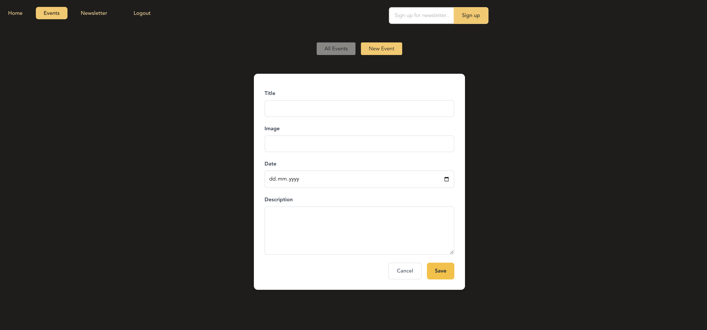
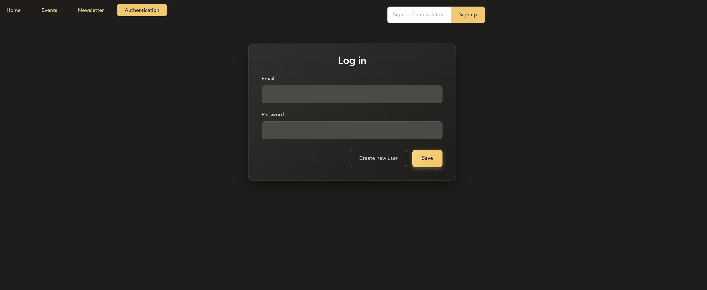

# React Event Management Application with Authorization

A modern, full-stack event management application built with React Router v6 and Express.js. Create, view, edit, and delete events with JWT-based authentication and a clean, intuitive interface.

## 🚀 Features

- **Authentication System**: JWT-based login/signup with secure token management
- **Protected Routes**: Authentication-required pages with automatic redirects
- **Event Management**: Full CRUD operations for events (login required for create/edit/delete)
- **Modern Routing**: React Router v6 with nested routes and loaders
- **Form Handling**: Advanced form management with validation
- **Newsletter Signup**: Integrated newsletter subscription
- **Auto Logout**: Automatic token expiration handling
- **Responsive Design**: Mobile-friendly interface
- **Error Handling**: Comprehensive error boundaries
- **Loading States**: Visual feedback during operations

## 📸 Screenshots

### Events List


### Event Form


### Auth


### Event Item


## 🛠️ Technology Stack

### Frontend
- **React 18** - Modern React with hooks
- **React Router v6** - Client-side routing with nested routes
- **JWT Authentication** - Secure token-based authentication
- **CSS Modules** - Scoped styling
- **Modern JavaScript** - ES6+ features

### Backend
- **Express.js** - Web application framework
- **Node.js** - Runtime environment
- **JWT (jsonwebtoken)** - Token generation and validation
- **bcryptjs** - Password hashing
- **UUID** - Unique identifier generation
- **JSON File Storage** - Simple data persistence

## 🏗️ Project Structure

```
eventhub/
├── frontend/
│   ├── src/
│   │   ├── components/
│   │   │   ├── AuthForm.js
│   │   │   ├── EventForm.js
│   │   │   ├── EventItem.js
│   │   │   ├── EventsList.js
│   │   │   ├── EventsNavigation.js
│   │   │   ├── MainNavigation.js
│   │   │   ├── NewsletterSignup.js
│   │   │   └── PageContent.js
│   │   ├── pages/
│   │   │   ├── Root.jsx
│   │   │   ├── HomePage.jsx
│   │   │   ├── EventsPage.jsx
│   │   │   ├── EventsRoot.jsx
│   │   │   ├── EventDetailPage.jsx
│   │   │   ├── EditEventPage.jsx
│   │   │   ├── NewEventPage.jsx
│   │   │   ├── AuthenticationPage.jsx
│   │   │   ├── Logout.jsx
│   │   │   ├── NewsletterSignupPage.jsx
│   │   │   └── ErrorPage.jsx
│   │   ├── util/
│   │   │   └── auth.js
│   │   └── App.js
│   └── public/
│       ├── home.png
│       ├── events.png
│       └── form.png
├── backend/
│   ├── routes/
│   │   ├── events.js
│   │   └── auth.js
│   ├── data/
│   │   └── event.js
│   ├── util/
│   │   ├── auth.js
│   │   ├── errors.js
│   │   └── validation.js
│   ├── events.json
│   └── app.js
└── README.md
```

### Authentication
| Method | Endpoint | Description |
|--------|----------|-------------|
| POST | `/signup` | Create new user account |
| POST | `/login` | Login existing user |

## 🔐 Authentication Features

### JWT Token Management
- **Secure Storage**: Tokens stored in localStorage with expiration
- **Auto Expiration**: 1-hour token validity with automatic logout
- **Protected Routes**: Authentication guards for sensitive operations
- **Conditional Navigation**: Dynamic nav based on auth state

### Security Features
- **Password Hashing**: bcryptjs for secure password storage
- **Token Validation**: Server-side JWT verification
- **Authorization Middleware**: Protected API endpoints
- **Automatic Cleanup**: Expired token removal

### User Experience
- **Seamless Login/Signup**: Single form with mode switching
- **Persistent Sessions**: Token-based session management
- **Graceful Logout**: Clean token removal and redirect
- **Error Handling**: User-friendly auth error messages

## 📋 Key Features

### React Router Architecture
- **Nested Routes**: Organized route structure with layouts
- **Route Loaders**: Data fetching before component render
- **Route Actions**: Form submission handling
- **Authentication Guards**: Protected route access control
- **Token Loading**: Global token state management
- **Error Boundaries**: Route-level error handling

### Event Management
- **Public Viewing**: Anyone can browse events
- **Protected Creation**: Login required to create events
- **Secure Editing**: Authentication required for modifications
- **Safe Deletion**: Authorized users only
- **Form Validation**: Client and server-side validation

### Authentication System
- **User Registration**: Secure account creation
- **Login/Logout**: JWT-based authentication
- **Session Management**: Automatic token handling
- **Route Protection**: Authentication-required pages
- **Auto Logout**: Token expiration management

### Modern UI Features
- **Responsive Design**: Works on all screen sizes
- **Loading States**: Visual feedback during async operations
- **Error Handling**: User-friendly error messages
- **Conditional UI**: Authentication-based interface changes
- **Navigation**: Intuitive navigation between sections

## 🎨 Styling

- **CSS Modules**: Component-scoped styling
- **Modern Design**: Clean, contemporary interface
- **Form Styling**: Modern form elements with focus states
- **Button Design**: Primary (yellow) and secondary button styles
- **Auth Forms**: Consistent login/signup form design
- **Responsive Layout**: Mobile-first approach

## 🔒 Data Validation

### Frontend
- **Form Validation**: Required fields, email format, password strength
- **URL Validation**: Image URL format checking
- **Date Validation**: Proper date format validation
- **Real-time Feedback**: Instant validation error display

### Backend
- **Input Sanitization**: Clean and validate all inputs
- **Authentication Validation**: Email/password verification
- **Authorization Checks**: Token-based access control
- **Custom Validators**: Structured validation functions
- **Error Responses**: Consistent error message format

## 🚀 Usage

1. **Browse Events**: Visit the events page to see all available events
2. **Create Account**: Sign up with email and password
3. **Login**: Access your account with credentials
4. **Create Events**: Add new events (authentication required)
5. **Edit Events**: Modify existing events (authentication required)
6. **Delete Events**: Remove events (authentication required)
7. **Auto Logout**: System automatically logs out after 1 hour

## 🔧 Development Notes

- **Token Expiry**: 1-hour JWT tokens with automatic frontend logout
- **Error Handling**: Separate handling for 401/422 vs other HTTP errors
- **State Management**: Global authentication state via React Router
- **Security**: CORS enabled, password hashing, JWT validation
- **User Experience**: Smooth authentication flow with proper redirects

⭐ Star this repo if you found it helpful!